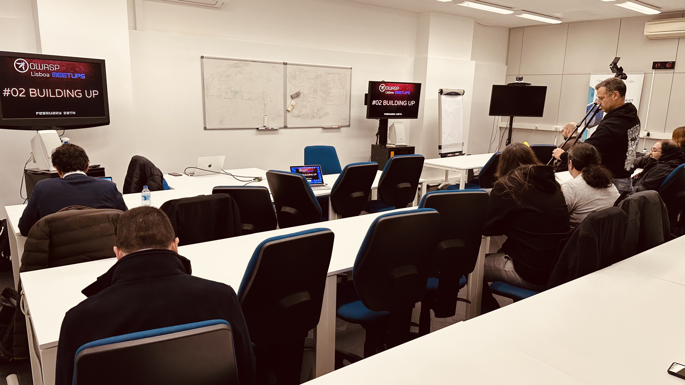
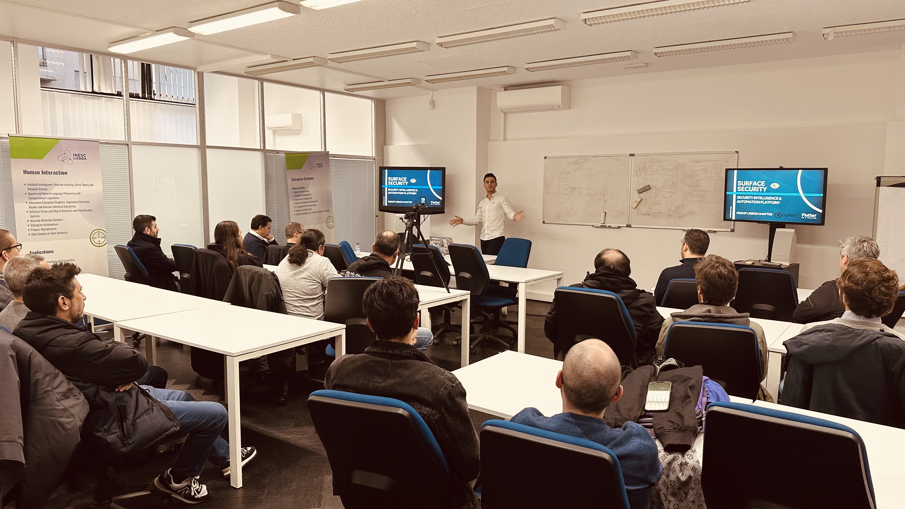
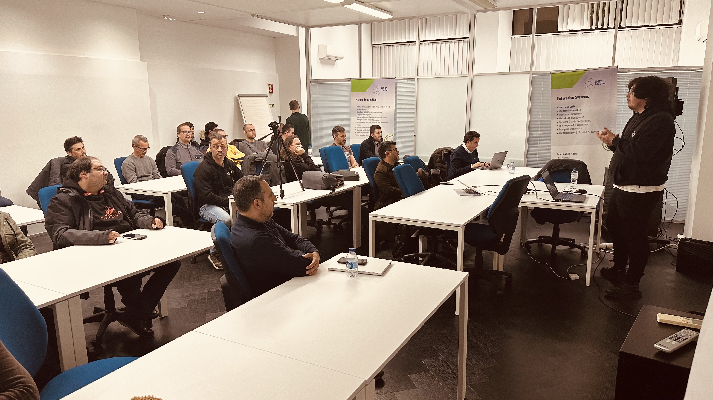
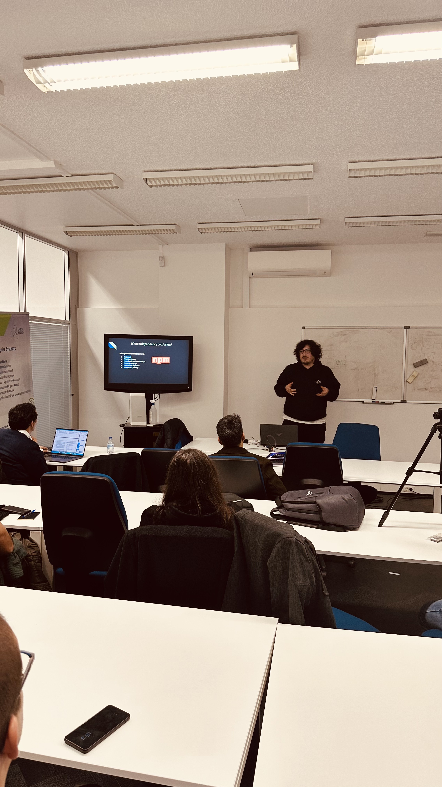

### Date:
February 28th, 2023

### Videos:

[Surface Security: The experience so far and the road ahead](https://youtu.be/zFiZWZ3z4_4)

[Is it private, is it public? Dependency Confusion](https://youtu.be/l_ODT7z8xhY)

### Location:
[INESC-ID, Rua Alves Redol 9, Lisboa](https://goo.gl/maps/aP8v2mUnzwneRH5v7)

This meetup was sponsored by [INESC-ID](https://www.inesc-id.pt/) and [AP2SI](https://ap2si.org/).

### Agenda:
* 18h00: **Welcome notes** by the OWASP Lisboa chapter leadership team
* 18h15: **Surface Security: The experience so far and the road ahead** by Gustavo Silva
* 19h00: **Is it private, is it public? Dependency Confusion** by Francisco Santos

* * *

### Surface Security: The experience so far and the road ahead
At Paddy Power Betfair (Blip.pt), throughout the years we have developed a tool to help us have an inventory of all internal assets, from servers, to DNS records, to endpoint devices, but to also integrate other tools in it, like open source scanners to help us detect vulnerabilities, understand our exposure, weaknesses and priorities, as well as leverage built-in notifications, a slack bot, and much more.

This talk is to talk about this project, which was open sourced recently, and what is the roadmap for the future.

#### Gustavo Silva
Software Developer by day, Security Researcher at night, I’m passionate for software security. The niche I am currently working on is engineering processes, tools, and internal interfaces to help companies secure their development lifecycles, do vulnerability management and increase overall awareness over the product's security risks.

[LinkedIn](https://www.linkedin.com/in/gsilvapt/)

* * *

### Is it private, is it public? Dependency Confusion
By 2021, the number of components in the average application rose 77 % from 298 to more than 500 open-source packages, those components are hosted on public repositories such as GitHub, NPM or PyPI, while some organizations choose to operate proprietary packages inside private registries of those repositories. Private or public, the management is done by CLI’s (like npm) and the CLI imports private or public packages via a simple precedence algorithm: If the package resides inside the private registry, import it. If not, import the public component. How can a bad actor play this to his advantage?

The is it private, is it public? Dependency Confusion talk explains what dependency confusion is, teaches ways of finding dependency confusion vulnerabilities in js files via BurpSuite with an automated tool called jsminer, a real example of a dependency confusion bug I found, and recommendations to mitigate those issues. By the end, breakers and makers should acquire a fresh new perspective on this issue.

#### Francisco Santos
I'm Francisco Santos, 23 years old. I always liked to think out of the box and find weird solutions to problems. I like logic and solving puzzles. I enjoy being a breaker and I want to add value to that community.

[LinkedIn](https://www.linkedin.com/in/francisco-santos-77917a210/)
[Twitter](https://twitter.com/andr0idp4r4n0id)

* * *

### Pictures from the meetup

* * *

* * *

* * *
