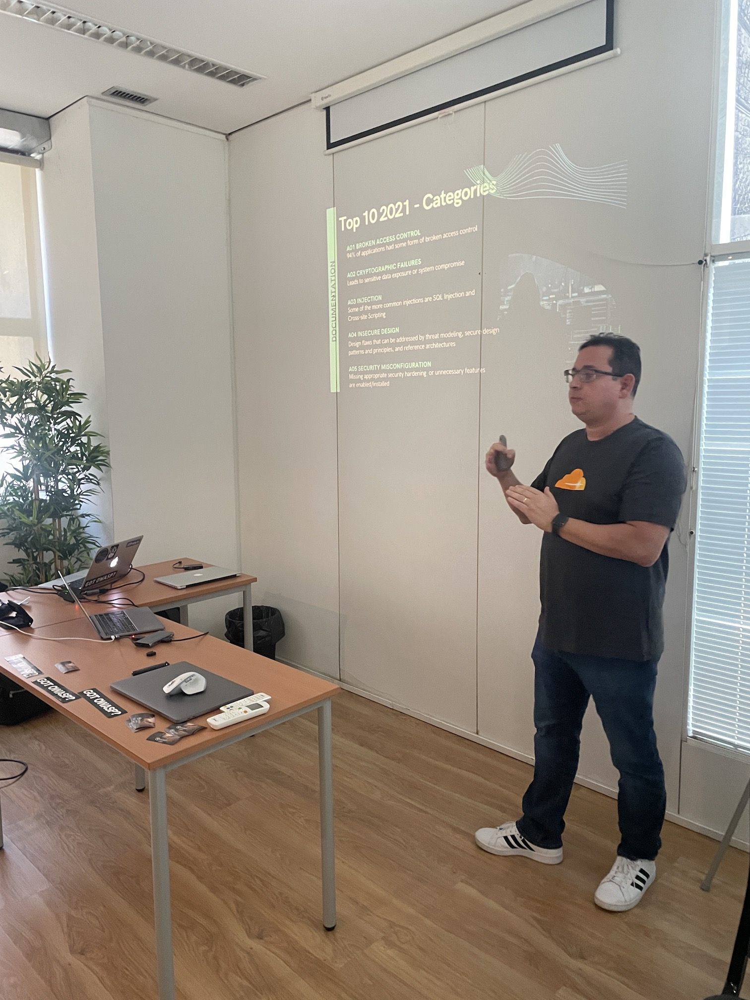
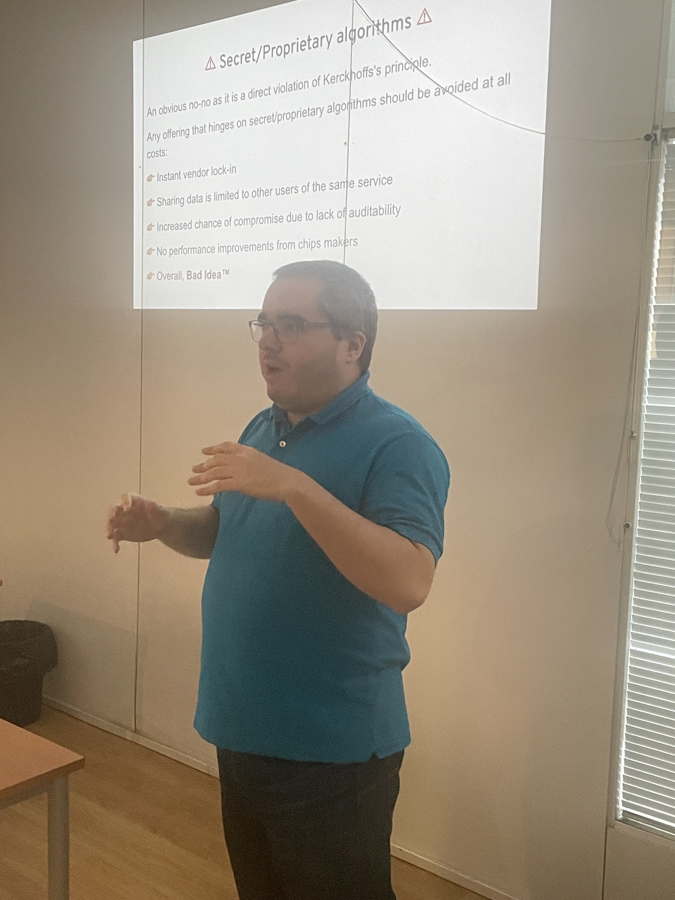
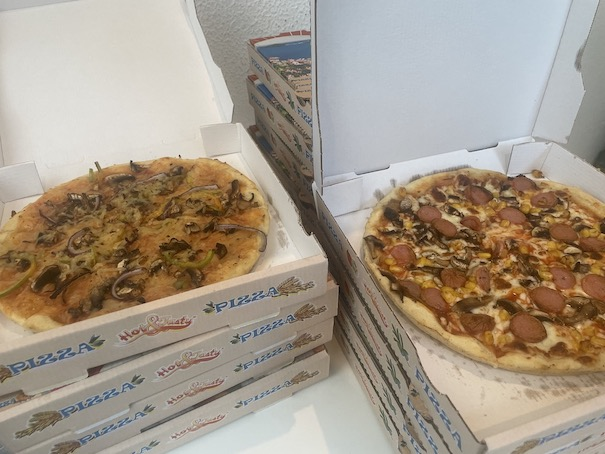

### Date:
May 30th, 2023

### Videos:

[Open projects you can use today to improve your AppSec posture](https://www.youtube.com/watch?v=M7keKmODZx8)

[One-Time Quantum-Resistant Fully-Homomorphic Padding Oracle cryptography trends, buzzwords, and snake oil for 2023](https://www.youtube.com/watch?v=Nv2ILzcFKiw)

### Location:
[Instituto CRIAP - Lisboa Campo Grande 220B · Lisboa](https://goo.gl/maps/ajVGbJ6bmAMSzHjg7)

This meetup is supported by [Snyk](https://snyk.io/) and [AP2SI](https://ap2si.org/).

### Agenda:
* 18h00: **Welcome notes** by the OWASP Lisboa chapter leadership team
* 18h15: **[Open projects you can use today to improve your AppSec posture](#open-projects-you-can-use-today-to-improve-your-appsec-posture)** by Lucas Ferreira
* 19h00: **[One-Time Quantum-Resistant Fully-Homomorphic Padding Oracle cryptography trends, buzzwords, and snake oil for 2023](#one-time-quantum-resistant-fully-homomorphic-padding-oracle-cryptography-trends-buzzwords-and-snake-oil-for-2023)** by Diogo Sousa
* 20:00: **Snacks & Drinks** sponsored by Snyk

### Open projects you can use today to improve your AppSec posture
"In this talk, we go through the most important OWASP projects (both documentation/standards and tools) to show how companies can improve their security posture and mature their AppSec program. It is meant as an overview of the main OWASP projects."

#### Lucas Ferreira
"Lucas is a long-time OWASP member, having worked in OWASP as a project leader and chapter leader on two continents. He was a member of the OWASP Global Conferences committee and lead the organization of 3 OWASP AppSec conferences in Brazil."

[LinkedIn](https://www.linkedin.com/in/ferreira/)
[Twitter](https://twitter.com/lucassapao)

### One-Time Quantum-Resistant Fully-Homomorphic Padding Oracle cryptography trends, buzzwords, and snake oil for 2023
"In our modern times, cryptography is all around us, even if we don't notice it. We use it when checking our bank statements, buying pig plushies online, or sending stickers to each other on instant messengers. Given its ubiquity, it is, for the most part, taken for granted by developers: import HTTP/crypto/TLS, throw in a certificate from Let's Encrypt, and don't think much about it while relying on (hopefully) safe defaults.

While sticking with well-vetted libraries should work out of the box for most cases, in certain areas, you need to be a bit more knowledgeable, if only to make good decisions about what libraries to use and how to wrangle all the moving parts into a cohesive and secure system.

Cryptography tends to be full of obscure notation that isn't that dissimilar to magic spells, and "Don't Roll Your Own Crypto" is an often repeated mantra (many times because of the previous statement). Search results for "crypto" have been getting progressively more complicated to navigate, with BTC, XRP, and others taking up all the prime SEO result space.
This talk targets a beginner to an intermediate audience and, starting from a brief overview of core tenets (Kerckhoffs's principle, Schneier's Law, the economy of mechanism, theoretical vs. practical security), will expand upon the current challenges and trends in modern cryptography, from FHE to PQC (including explaining what those are), and also highlight common design pitfalls (and their consequences) and how to reduce your snake oil intake."

#### Diogo Sousa
"An opinionated individual with interest in cryptography and its intersection with secure software development."

[LinkedIn](https://www.linkedin.com/in/0xdsousa/)

### Pictures from the meetup

