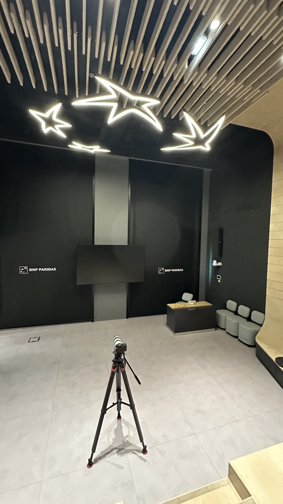
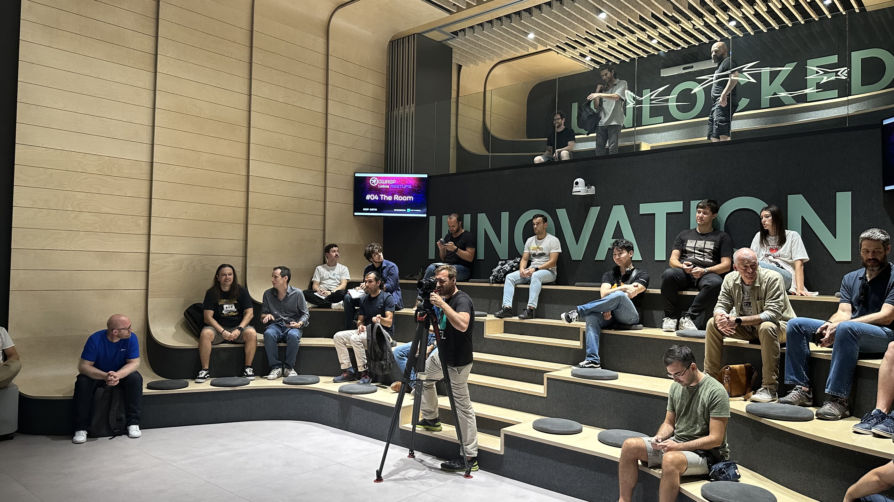
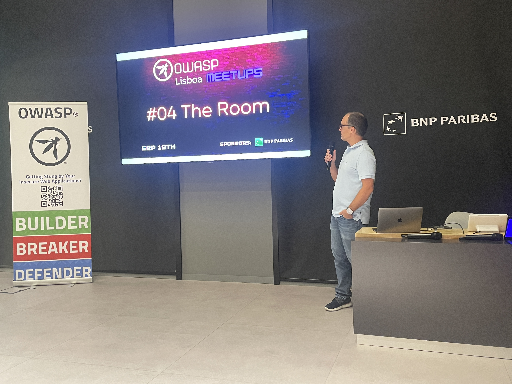
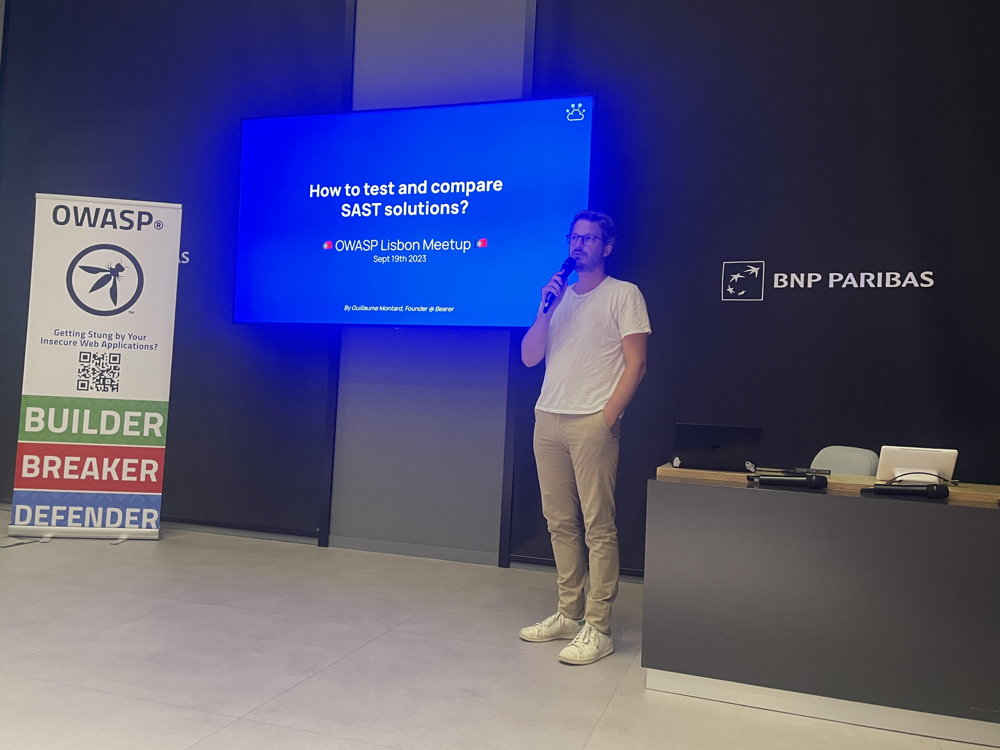
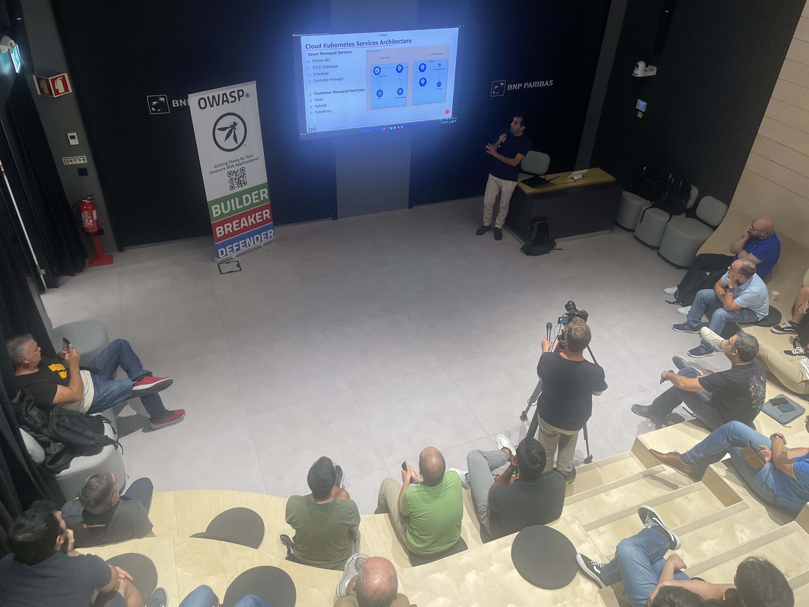
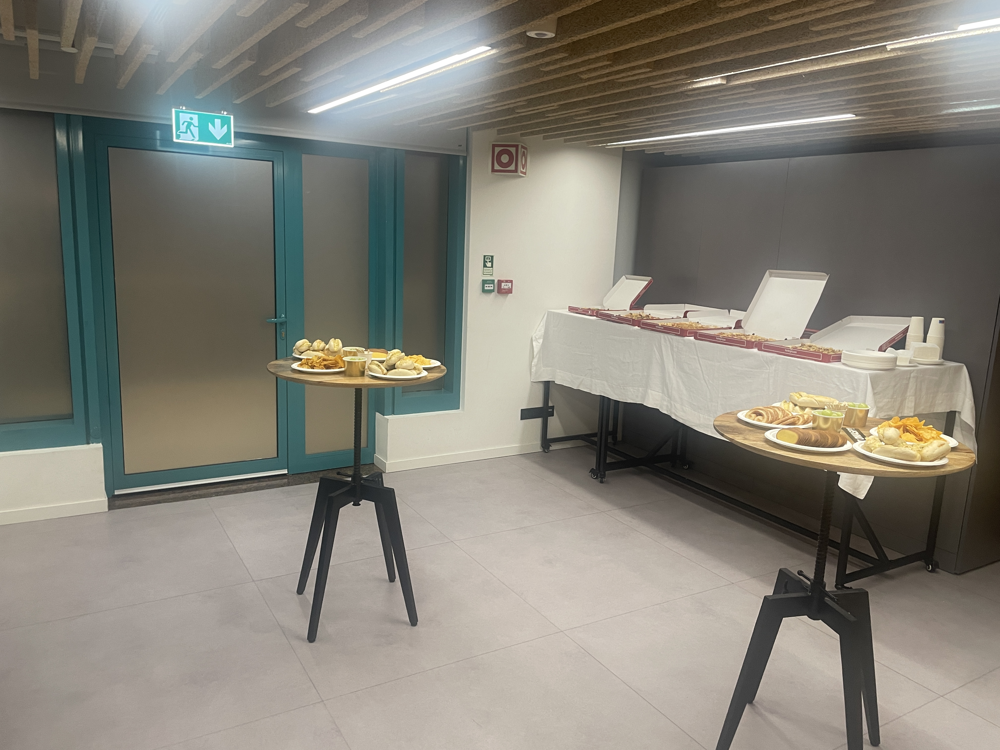

### Date:
Sep 19th, 2023

### Videos:

[How to test and compare SAST solutions](https://youtu.be/ca7QGXSU4Uk)

[Unmasking Azure Kubernetes Service - Unveiling Inherent Security Risks in K8S Environments](https://youtu.be/-NSoc_0qd_Q)

### Location:
[Torre Ocidente, Rua Galileu Galilei 2, in the Colombo Shopping Center](https://goo.gl/maps/kBcg5XbShzMqNGhJ9)

This meetup was sponsored by [BNP Paribas](https://www.bnpparibas.pt/).

### Agenda:
* 18h00: **Welcome notes** by the OWASP Lisboa chapter leadership team
* 18h20: **How to test and compare SAST solutions** by Guillaume Montard
* 19h00: **Unmasking Azure Kubernetes Service - Unveiling Inherent Security Risks in K8S Environments** by Sadi Zane
* 20:00: **Food & Drinks** sponsored by BNP Paribas

* * *

### How to test and compare SAST solutions
Over the past two decades, many of us have had negative experiences with SAST. In this talk, I will explain SAST, its significance, and introduce a framework that allows you to test and compare the latest SAST solutions. By the end, I hope to change your perspective on SAST.

#### Guillaume Montard
Guillaume, co-founder of Bearer, developer-first security solution. Previously CTO and VP of Engineering at Skillsoft.

[LinkedIn](https://www.linkedin.com/in/guillaumemontard/)
[Twitter](https://twitter.com/g_montard)

* * *

### Unmasking Azure Kubernetes Service - Unveiling Inherent Security Risks in K8S Environments
This talk delves into the security risks associated with Azure Kubernetes Service (AKS). Specifically, it focuses on a deep dive into key security controls like Role-Based Access Control (RBAC) and explores associated risks with service accounts. Additionally, the talk presents a novel approach highlighting how an attacker could exploit Node authorization certificate keys to achieve long-term persistence within AKS environments and their underlying containers. Furthermore, the presentation describes and demonstrates an attack against a vulnerable Grafana enterprise application by leveraging directory traversal techniques to steal privileged tokens. These tokens serve as a stepping stone for further pivoting into the container environment. The talk also addresses the inherent shortcomings of default Azure Kubernetes deployments, including vulnerabilities related to secrets management, pod security admission, and underlying networks. By shedding light on these deficiencies, attendees gain a comprehensive understanding of the security challenges and potential avenues for improvement in AKS environments.

#### Sadi Zane
Sadi Zane is a Principal Cyber Security Consultant specialising in offensive security, Red Team/Purple Team exercises, and extensive experience in Orchestration technologies e.g., Cloud on premise Kubernetes container security systems.

[LinkedIn](https://www.linkedin.com/in/sadi-zane-bb6430206/)

* * *

### Pictures from the meetup

* * *

* * *

* * *

* * *

* * *

* * *
