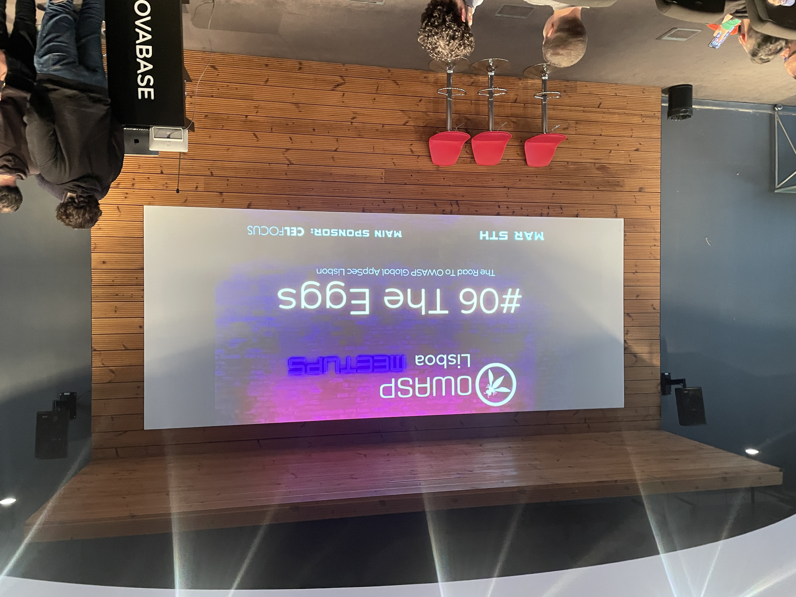
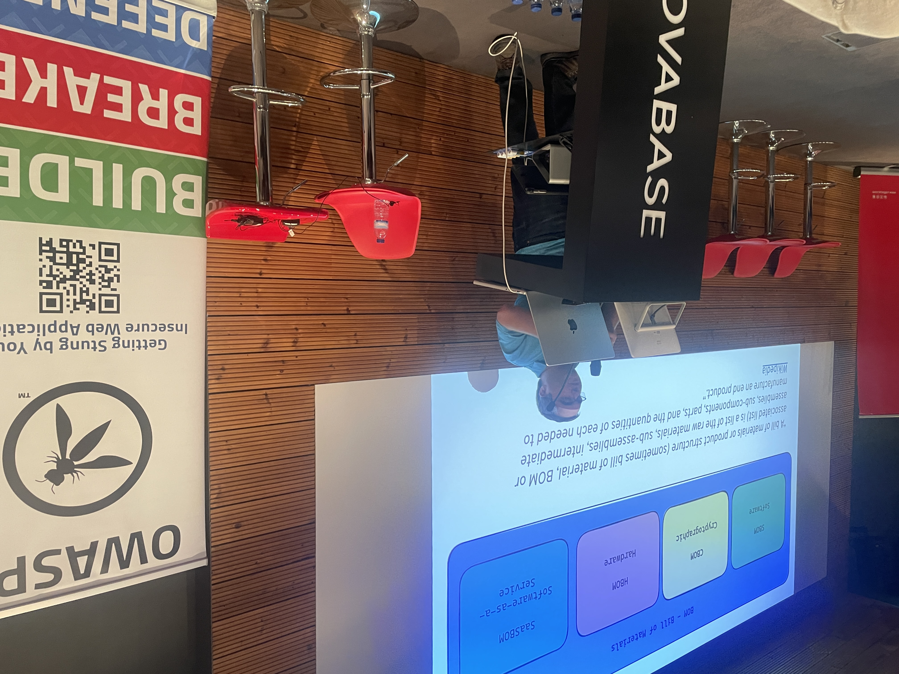
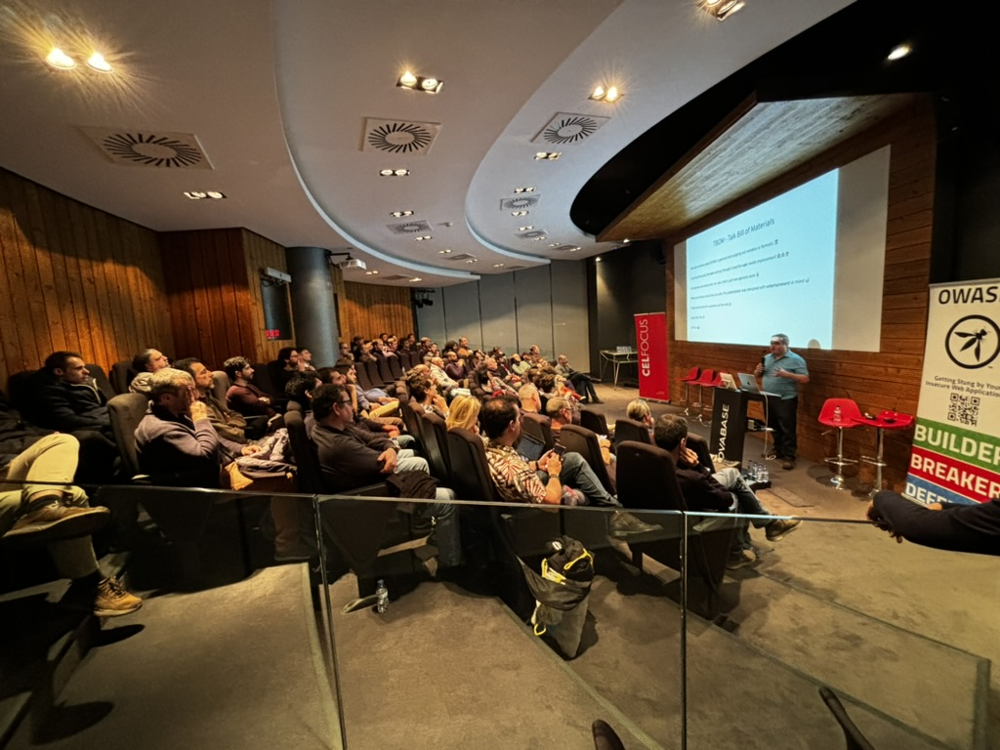

### Date:
Mar 5th, 2024

### Videos:
Soon!

### Location:
[Celfocus, Av. Dom João II 34, 1998-031 Lisboa](https://maps.app.goo.gl/cy4D1sEuN1fNSdFB8)

This meetup is supported by [Celfocus](https://www.celfocus.com/) and [AP2SI](https://ap2si.org/).

### Agenda:
* 18h00: **Welcome notes** by the OWASP Lisboa chapter leadership team
* 18h15: **[LLM Security: The OWASP Top 10 Journey](#llm-security-the-owasp-top-10-journey)** by Jorge Pinto
* 19h10: **[SBOM, SBOM, you're an SBOM](#sbom-sbom-youre-an-sbom)** by Diogo Sousa
* 20:00: **Drinks & Dinner** sponsored by Celfocus

### LLM Security: The OWASP Top 10 Journey
"Join me for a journey into the development of the OWASP Top 10 for Large Language Model Applications. In this presentation, we will uncover the background, challenges, and collaborative efforts that led to the creation of this resource for the cybersecurity community.

The presentation will be around 20~30 minutes incl. Q&A and will have the following structure:

(1) Introduction

Introduce the audience to Large Language Models (LLMs) and their significance.
Explain why creating an OWASP Top 10 for LLMs was necessary to address LLM security concerns.

(2) Project Development

Describe the inception of the OWASP Top 10 for LLMs project and key contributors.
Highlight any challenges faced during its development and how they were overcome.

(3) Top 10 LLM Security Risks and Mitigation

Present the identified top security risks associated with Large Language Models.
Offer practical recommendations and mitigation strategies to address these risks.

(4) Conclusion and Future Outlook (2-3 minutes)

Summarize the main takeaways from the presentation.
Discuss the ongoing relevance and future of LLM security and the OWASP Top 10 for LLMs."

#### Jorge Pinto
"With more than 25 years of experience, Jorge Pinto is a professional in the area of information security in Portugal. With a degree in Computer Engineering from the University of Lisbon, he is a Senior Engineer and has several certifications such as CISSP, CISA, CISM and CRISC. Throughout his career he has played several roles, contributing to the effective response of various entities to security, privacy and business continuity challenges. Founder and president of AP2SI, co-organizer of BSidesLisbon and active member of several associations, including OWASP, he is a committed professional dedicated to promoting good practices and knowledge of information security in Portuguese society."

[LinkedIn](https://www.linkedin.com/in/jorgepinto/)

### SBOM, SBOM, you're an SBOM
"Software Bill of Materials (SBOM) is a concept that recently has been making waves in SDLC spaces but it isn't entirely new. Most mature languages have a (sometimes) mature package management system, either built-in (e.g., Rust's cargo) or de facto (e.g., Maven) that allows developers to define dependencies, resolve conflicts and do composition analysis.

SBOMs, however, allow you to take this one step further, making it language-agnostic and allowing components from different ecosystems to use a common language for comparisons and analysis. However, we don't get those features out of the box. For example, consider common libraries in different package repositories - are all OpenSSL packages created equally and equivalent?

OWASP is playing a part in this via its support for projects like CycloneDX which aims to provide a full-stack BOM standard to cover specific scopes such as the CBOM (Cryptography) and HBOM (Hardware) among others.

This shift towards software being more transparent and traceable is not without its detractors, as entire business models are predicated on customers using purely opaque boxes.

In the spirit of the topic, here is a Talk Bill of Topics:

- Are BOM requirements burdensome?
- Are we revealing too much of the "secret sauce"?
- Does having an SBOM instantly make a piece of software more secure?
- If we take a piece of software and replace every entry in its BOM with fully equivalent packages, one by one, is it still the same software in the end?

This talk targets a beginner to intermediate audience and will provide an overview of (S)BOMs, their ongoing challenges, and what they can bring to the table in terms of security."

#### Diogo Sousa
"An opinionated individual with an interest in cryptography and its intersection with secure software development."

[LinkedIn](https://www.linkedin.com/in/0xdsousa/)

### Pictures from the meetup

