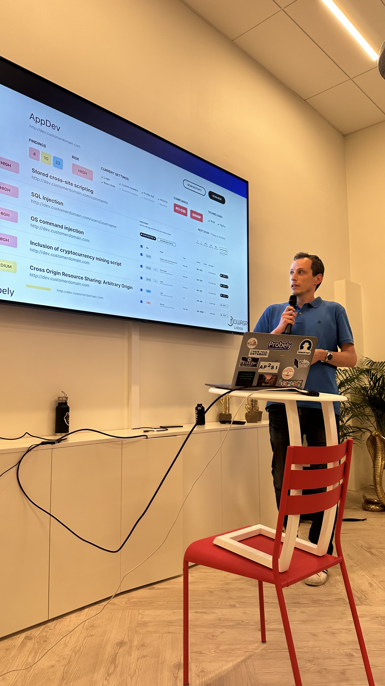
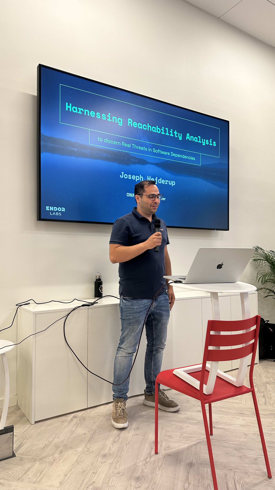

### Date:
May 28th, 2024

### Videos:
Soon!

### Location:
[Springer, Rua Castilho 77, 1070-050, Lisboa](https://maps.app.goo.gl/PDj7uaD8emtNhFVLA)

This meetup is supported by [Springer Nature Group](https://www.springernature.com/) and [AP2SI](https://ap2si.org/).

### Agenda:
* 18h00: **Welcome notes** by the OWASP Lisboa chapter leadership team
* 18h15: **Technical Challenges of Security Scanning in CI/CD** by Tiago Mendo
* 19h10: **Harnessing Reachability Analysis to Discern Real Threats** by Joseph Hejderup
* 20:00: **Drinks & Dinner** sponsored by Springer Nature Group

### Technical Challenges of Security Scanning in CI/CD
"Have you ever tried to add a web application security scanner to a CI/CD pipeline?
I intend to draw attention to some of the challenges that development/security teams experience when trying to automate security tests.
The objective is to make the audience aware of these problems so that they can solve them as soon as possible, increasing the success of the tests and the adoption by the teams, which, in the end, will lead to greater security for the organization.
The focus will be on problems such as the scale of tests, speed of obtaining results, false positives and how these can destroy the process - or make it more expensive, and the use of the tools itself. All problems will be based on real situations, with examples whenever possible. I will propose solutions for different teams' maturity levels, giving practical tips to start implementing security in the developers' pipeline."

#### Tiago Mendo
"Tiago Mendo is a co-founder and CTO of Probely, a cybersecurity company that does web and API security scanning. With over 19 years of experience in the security field, he has extensive experience in pentesting applications, training, and providing all-around security consultancy.
Holds a Master's in Information Security from Carnegie Mellon University and a CISSP certification. He is also a qualified member of AP2SI, a non-profit organization that promotes Information Security, and Co-Leader of the OWASP Lisboa Chapter, in Portugal.
He is also an international speaker at security conferences, such as SnowFROC, LASCON, BSides Kraków, and BSides Lisbon."

[LinkedIn](https://www.linkedin.com/in/tiagomendo/)

### Harnessing Reachability Analysis to Discern Real Threats in Software Dependencies
"In this talk, we will dive into the shortcomings of traditional dependency analysis methods, which usually focus on looking at build manifests and metadata, to spot security or performance vulnerabilities in Java projects. While tools like Maven Dependency Checker and Gradle's dependency-analysis plugin are invaluable for their ability to manage dependencies, they often fall short when we need quick and precise answers, forcing developers to lean on time-consuming tests and manual code reviews. We believe that a thorough look at how dependencies are actually used in the code—with the help of static and reachability analyses—can be a more effective way to pinpoint real threats in Java dependencies.

We'll use real-world examples to show how static analysis, and in particular reachability analysis, offers deeper insights into potential vulnerabilities by moving beyond simple metadata. By sharing examples where static analysis has been a game-changer, and pointing out where it might not be enough, we aim to shed light on the challenges and opportunities this method brings to improving security and performance in software projects.

Our goal is to provide attendees with practical strategies for using static and reachability analyses, promoting a more detailed method for managing dependencies and finding vulnerabilities in software applications."

#### Joseph Hejderup
"Part-time developer, part-time PhD student, full-time enthusiast in developing and researching techniques that makes package management system more intelligent and resilient against supply chain problems! Joseph Hejderup (Researcher/Software Engineer at Endor Labs & PhD student at Delft University of Technology) is applying program analysis techniques to better understand how we use third-party components and what risks third-party components entails from a security and maintenance perspective. Currently, he is applying years of research in Endor Labs with the mission to make dependency management a robust process that will empower developers, increase productivity, and solve security problems."

[LinkedIn](https://www.linkedin.com/in/josephhejderup/)

### Pictures from the meetup

