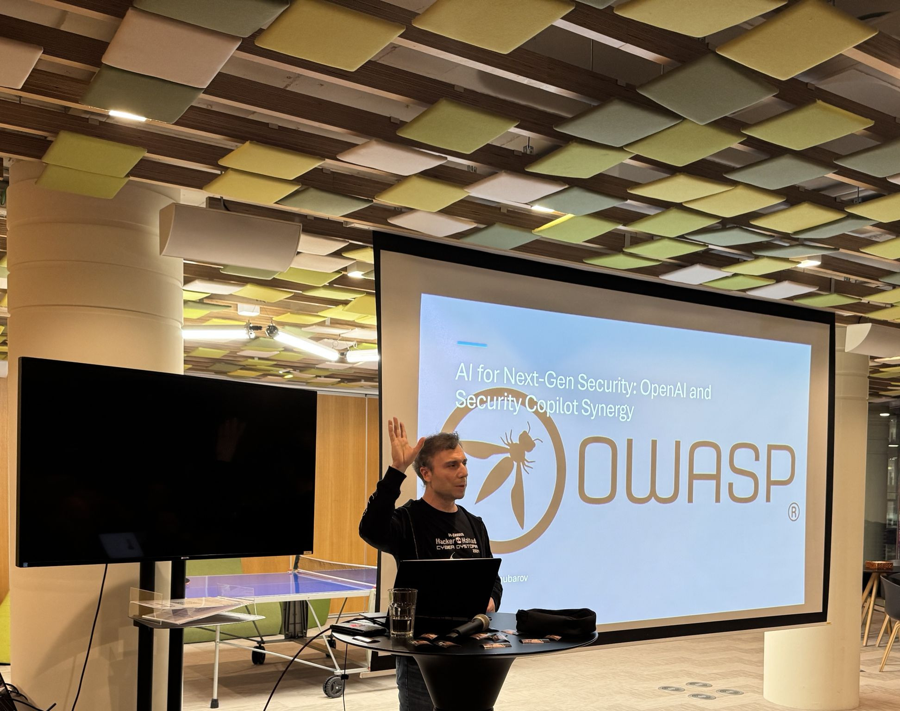
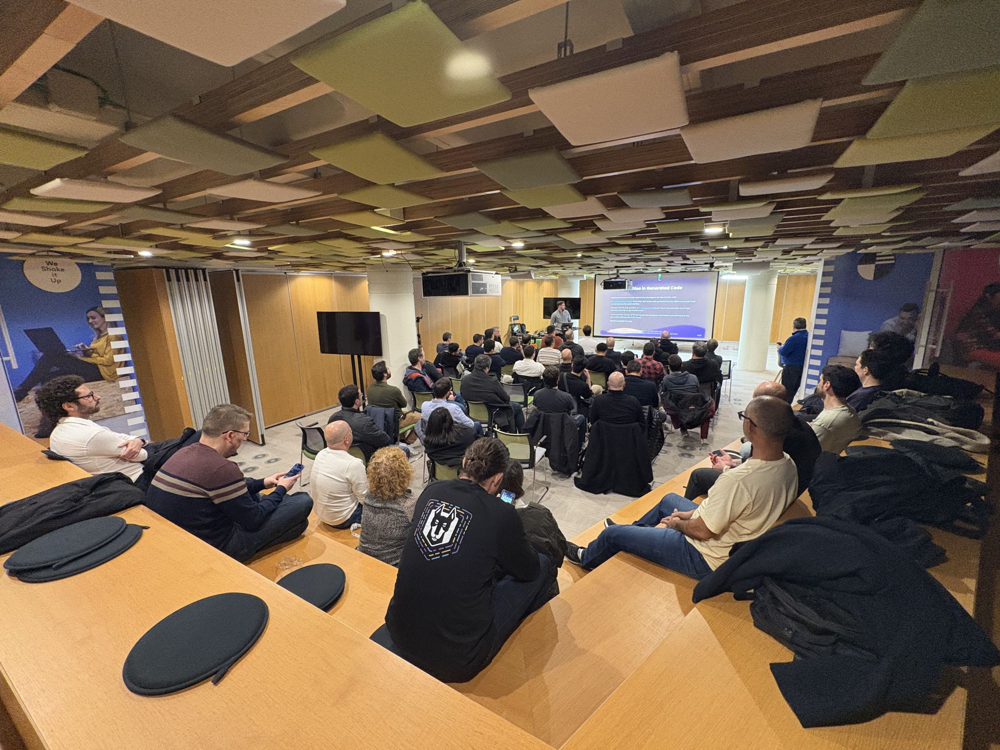

### Date:
Jan 15th, 2025

### Videos:
[AI for Next-Gen Security: OpenAI and Security Copilot Synergy](https://youtu.be/_bfaFk0Hbqc)

[Practical Security Guard Rails for LLM](https://youtu.be/cKMcgf2ZqaI)

### Location:
[OLX Portugal - Praça Duque de Saldanha nº 1 · Lisboa](https://goo.gl/maps/yeJVScaFdtoZcLoG7)

This meetup was sponsored by [OLX](https://olx.pt/) and [AP2SI](https://ap2si.org/).

### Agenda:
* 18h00: **Quick intro** by the OWASP Lisboa chapter leadership team
* 18h10: **AI for Next-Gen Security: OpenAI and Security Copilot Synergy** by Sergey Chubarov
* 19h10: **Practical Security Guard Rails for LLM** by Nick Vinson
* 20:00: **Drinks & Dinner** sponsored by OLX

* * *

### AI for Next-Gen Security: OpenAI and Security Copilot Synergy
This demo-based session explores the potent collaboration between OpenAI and Copilot for Security.

Discover how the fusion of artificial intelligence is revolutionizing threat detection, response strategies, and proactive risk mitigation.

The session contains following topics:
- Start free: Microsoft Copilot for SOC Operations
- Security Copilot: Extra helping hand of Analyst
- Azure OpenAI: How AI-driven incident response leverages intelligent automation

#### Sergey Chubarov
Sergey Chubarov is a Security and Cloud Expert, Instructor with 15+ years' experience on Microsoft technologies.

His day-to-day job is to help companies securely embrace cloud technologies.

He has certifications and recognitions such as Microsoft MVP: Security, OSCP, OSEP, eCPPT, eCPTX, Microsoft Certified Trainer, MCT Regional Lead, EC Council CEH, CPENT, LPT, CCSE, CEI, CREST CPSA, CRT and more.

Frequent speaker at local and international conferences like Global Azure, DEF CON, Black Hat Europe, Wild West Hackin' Fest, Security BSides, Workplace Ninja, Midwest Management Summit, Hack in the Box, Hack in Paris etc.

Prefers live demos and cyberattacks simulations.

[LinkedIn](https://www.linkedin.com/in/schubarov/)

* * *

### Practical Security Guard Rails for LLM
LLM based systems are being built and deployed at a rapid pace and new security threats are being introduced as a consequence. In this talk we'll discuss the nature of these threats and what security controls can be implemented to protect against them.

#### Nick Vinson
Nick has 14 years in the tech industry spanning across both security and engineering roles. In his current role Nick leads the Product Security function at Snyk, a cybersecurity company that builds developer-first security products.

[LinkedIn](https://www.linkedin.com/in/nick-vinson-a147971bb/)

* * *

### Pictures from the meetup

* * *

* * *

* * *
