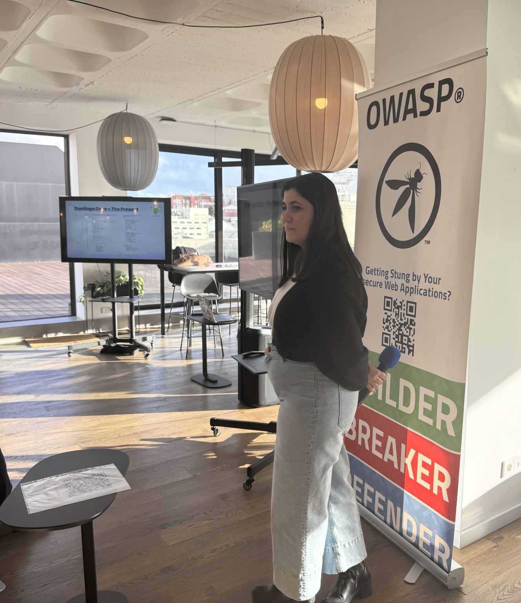
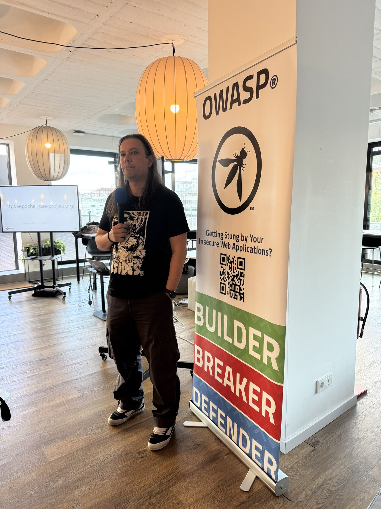

### Date:
Apr 2nd, 2025

### Videos:

Publication pending.

### Location:
[INSCALE - Av. da Liberdade 36 · Lisboa](https://maps.app.goo.gl/DkSqfPSvRb7XKjrN9)

This meetup was sponsored by [INSCALE](https://www.inscale.net/) and [AP2SI](https://ap2si.org/).

### Agenda:
* 18:00 - **Quick intro** by the OWASP Lisboa chapter leadership team
* 18:15 - **Can APIs Be the Silent Players in the Social Engineering Game?** by Teresa Pereira
* 19:00 - **~~Jedi~~ GenAI Mind Tricks - Are these the secure chatbots you’re looking for?** by Bruno Morisson
* 20:00 - **Drinks & Dinner** by INSCALE

* * *

### Can APIs Be the Silent Players in the Social Engineering Game?

This talk delves into the pervasive yet often overlooked role of APIs in the realm of social engineering. Through a comprehensive exploration of case studies, security vulnerabilities and ethical considerations, this talk uncovers the hidden risks associated with APIs and gives you proactive measures to mitigate the potential for social engineering attacks facilitated by these silent weapons.

#### Teresa Pereira

Teresa Pereira, also known as starmtp, is a Cyber Threat Hunter at Siemens Energy with expertise in penetration testing, red teaming, API security, and threat hunting. Previously at KPMG Portugal, she specialized in vulnerability exploitation, OSINT, social engineering, and API pentesting.*

A dynamic and engaging speaker, Teresa has shared her expertise at prominent events, including apidays Paris 2023, apidays London 2024, the Geek Girls Portugal Conference 2024, apidays Paris 2024 and OWASP Porto Meetup. Her professional credentials include API Security Certified Professional (ASCP) and Certified in Cybersecurity (CC).
Ranked among the top 4% on TryHackMe, Teresa is a Women in Security and Privacy (WISP) Volunteer, an APIsec University Ambassador, and also co-leads the OWASP Leiria Chapter, where she actively supports the cybersecurity community. She developed the course "Getting Started in API Pen-Testing" for APIsec University and authored the insightful article "How Can HTTP Status Codes Tip Off a Hacker?".

In 2024, Teresa was named API Security Person of the Year (ASPY) by the APIsec University board. In 2025, she created a room on TryHackMe entitled "Vulnerability Chaining".

With a degree in Computer Engineering and a strong passion for mentoring, Teresa is dedicated to advancing cybersecurity awareness and resilience across diverse industries.

[LinkedIn](https://pt.linkedin.com/in/maria-teresa-pereira)

* * *

### ~~Jedi~~ GenAI Mind Tricks - Are these the secure chatbots you’re looking for?

After experimenting with various public challenges on LLM chatbots—like Gandalf, PromptAirlines, and more—I decided to build my own. Not just to understand how LLMs work, but to see how easily I could break them.

In this talk, I’ll dive into the security risks of Generative AI, particularly LLM chatbots, and explore vulnerabilities that are often overlooked. From sensitive information disclosure to prompt injections and jailbreaking, I’ll walk through real-world examples showing just how these systems can be manipulated.

#### Bruno Morisson

Bruno Morisson is a seasoned cybersecurity expert with over two decades of experience in offensive security, penetration testing, and red teaming. As the Partner and Offensive Security Services Director at Devoteam Cyber Trust, he leads world-class security testing across web and mobile applications, IoT, OT/SCADA, and threat-led penetration testing frameworks like TIBER-EU and DORA.

Beyond his professional work, Bruno is a driving force in the cybersecurity community. He is the founder and organizer of BSidesLisbon, Portugal’s top security conference, and serves as a CREST Europe Council member, helping shape industry standards. His research contributions include multiple CVE disclosures, Metasploit modules, and publications on SAP security, honeypots, and Linux audit systems.

Bruno holds an MSc in Information Security from Royal Holloway, University of London, alongside an impressive list of certifications, including OSCP, CISSP, CISA, and GIAC GPEN.

And in case you were wondering—yes, this entire bio was generated by GenAI.

[LinkedIn](https://www.linkedin.com/in/nick-vinson-a147971bb/)

* * *

### Pictures from the meetup

* * *

* * *

* * *

* * *
