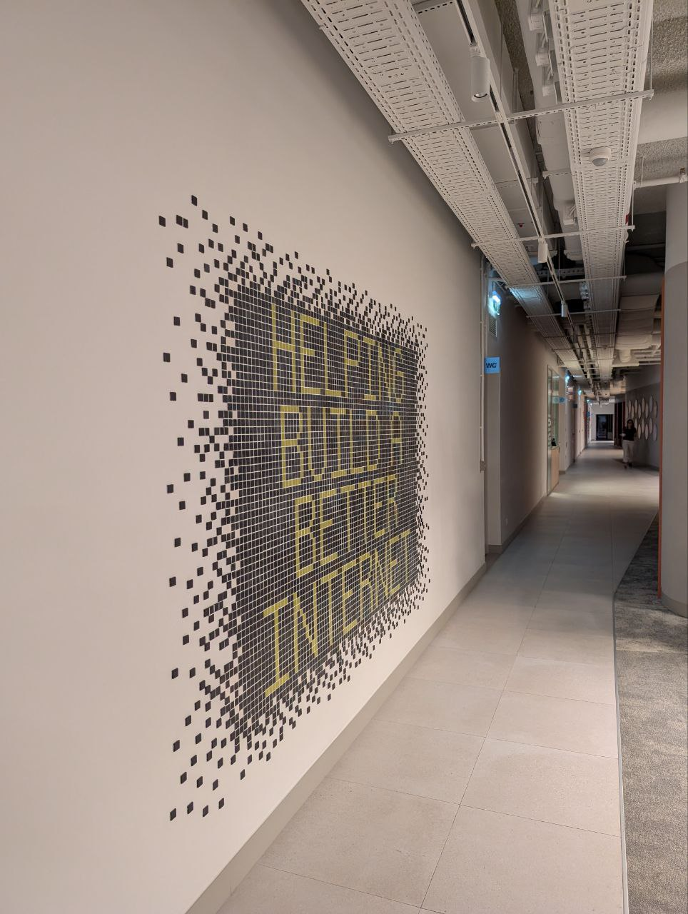

### Date:
Sep 10th, 2025

### Location:
[Cloudflare - ALLO · Lisboa](https://maps.app.goo.gl/pP9pWdcfTa4ZWsydA)

This meetup is supported by [Cloudflare](https://www.cloudflare.com/) and [AP2SI](https://ap2si.org/).

### Agenda:
* 18:00 - **Quick intro** by the OWASP Lisboa chapter leadership team
* 18:25 - **HTML Smuggling to EDR Bypass** by Milton Araújo
* 19:05 - **Implementing a custom vulnerability management program that doesn't stop your business** by Luís Fontes
* 20:00 - **Drinks & Dinner** by Cloudflare

### HTML Smuggling to EDR Bypass

The aim of this talk is to demonstrate various techniques of HTML Smuggling and how they can be utilized to bypass traditional Antivirus (AV) and Endpoint Detection and Response (EDR) solutions. Despite being an older technique, HTML Smuggling remains relevant and effective against contemporary security measures, making it a compelling topic in the cybersecurity landscape.

HTML Smuggling is a method employed by cybercriminals to covertly deliver malicious payloads directly to a target device through web browsers. This technique exploits the way browsers interpret HTML and JavaScript, allowing attackers to disguise their actions within seemingly benign web pages. Once a user visits a compromised page, the embedded malicious code can dynamically download files without raising red flags. This process often circumvents common security mechanisms that rely on detecting known file types or extensions.

During the talk, I will explain the underlying principles of HTML Smuggling, present various attack vectors, and demonstrate real-world applications of this technique. Audience members will gain insights into how attackers leverage this method to bypass security frameworks, as well as important considerations for defending against such tactics.

---

***Milton Araújo** is a Security Researcher at r19.io specializing in red teaming, malware development, evasion techniques, and reverse engineering. They help organizations improve their defenses by simulating real-world adversaries and exposing the gaps that traditional tools often miss.*

*Their work focuses on designing advanced offensive operations that bypass modern detection technologies like EDR, AV, XDR, and sandboxes. They build custom implants, memory-resident payloads, and stealthy execution frameworks to replicate the tactics of sophisticated threat actors. Milton also has broad experience in penetration testing, malware analysis, and offensive infrastructure development.*

*Outside of research, they contribute to the OWASP community and teach offensive security at the postgraduate level. They also host r19.io, a podcast featuring in-depth conversations with hackers, red teamers, and security researchers from around the world.*

[LinkedIn](https://www.linkedin.com/in/milton-araujo/)

### Implementing a custom vulnerability management program that doesn't stop your business

Vulnerability management today is a tangled web of overlapping tools, scan techniques, and fragmented solutions. While Application Security Posture Management (ASPM) platforms claim to simplify this landscape, they often sacrifice flexibility, leaving teams stuck with false positives, limited customization, and poor integration.

In this talk, we share how we tackled these challenges by building our own vulnerability management program, leveraging open-source tools and deeply integrating them into our Software Development Life Cycle (SDLC). You’ll learn about the architecture, key design decisions, lessons learned, and the principles we believe are essential for building a successful, developer-friendly, and fully controlled security pipeline.

---

***Luís Fontes** is a security engineer with over 7 years of experience in cybersecurity and 17 years of hands-on coding. He currently works as a Product Security Engineer at Xapo bank, safeguarding thousands of clients' balance worldwide. Prior to this, he worked with blockchain technologies and conducted in-depth code reviews for Fortune 500 companies, identifying critical vulnerabilities across complex systems.*

*His journey in security began early, exploiting SQL injections when it was cool, and he now focuses on building pragmatic, developer-friendly security programs.*

[LinkedIn](https://www.linkedin.com/in/luisfontes19/)

### Pictures from the meetup

