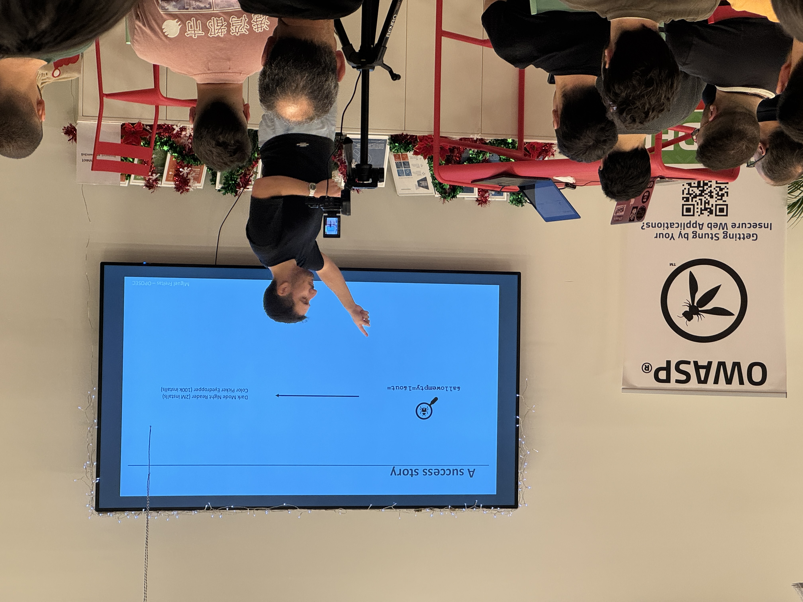
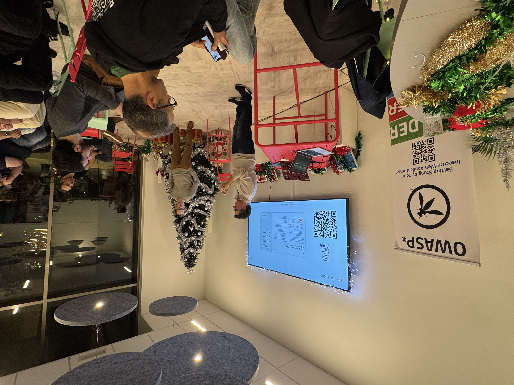
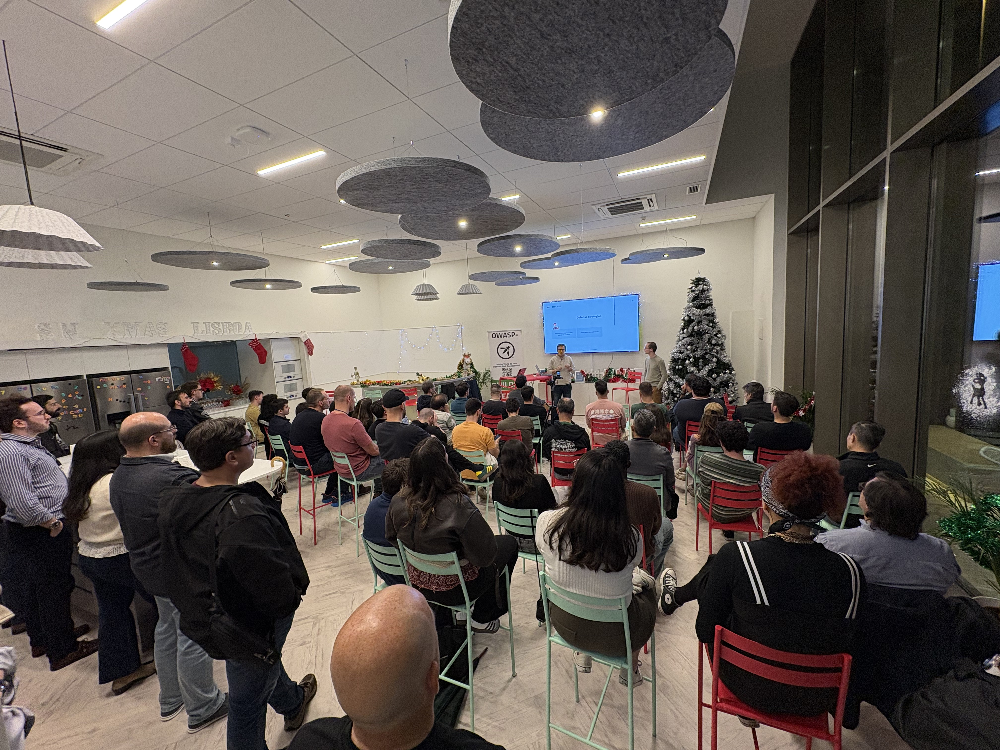

### Date:
Nov 12th, 2025

### Location:
[Springer Nature - Lisboa](https://maps.app.goo.gl/fyfdkZWFqAWMrRebA)

This meetup is supported by [Springer Nature](https://www.springernature.com/) and [AP2SI](https://ap2si.org/).

### Agenda:
* 18:15 - **Quick intro** by the OWASP Lisboa chapter leadership team
* 18:25 - **Compromising Chrome Extensions for Passive Income** by Miguel Freitas
* 19:00 - **From Secure Design to Responsible AI Development - Celfocus Approach** by Pedro Tarrinho
* 20:00 - **Drinks & Dinner** by Springer Nature

### Compromising Chrome Extensions for Passive Income

This talk goes over an investigation into widespread malicious Chrome extensions that were affecting millions of users worldwide.

---

*I am Offensive Security professional turned SOC manager. I currently manage Five9's global SOC and Red Teams.*

*A big fan of making Red Teaming and Penetration Testing fundamental components of an organization's cybersecurity program. I love cyber threat intelligence and malware reverse-engineering. Experienced in digital forensics and incident response in organizations of all shapes and sizes.*

[LinkedIn](https://www.linkedin.com/in/mbie/)

### From Secure Design to Responsible AI Development - Celfocus Approach

As AI solutions mature and are integrated into real-world environments, new classes of security gaps are emerging. This session takes a practical look at how vulnerabilities can appear throughout the AI lifecycle, from the early design phase to day-to-day operation. Using concrete examples such as prompt injection, data exposure and jailbreak attacks, it highlights how subtle oversights can quickly become exploitable weaknesses.

The talk then walks through a Security by Design approach tailored for AI, covering threat modelling, privacy-preserving techniques, secure development, testing strategies, and continuous monitoring. The focus is on applying structured security controls across six key stages: planning and design, data processing, model development, verification, deployment, and operational monitoring.

It will also touch on proven defensive measures and industry standards like the OWASP Top 10 LLMs and MITRE ATLAS, showing how they can be applied in real projects. The aim isn’t just to avoid incidents, but to build trustworthy, responsible AI systems from the ground up.

---

***Pedro Tarrinho** is Director of Application Security at Celfocus, where he leads strategic initiatives to integrate security throughout the development lifecycle and drive “security by design” practices. With over 20 years of experience in technology and telecommunications, he combines strong technical expertise with a practical vision, helping teams and organizations embed security seamlessly into software delivery.*

*He has spoken at several conferences including OPOSEC, OWASP Porto, sessions at the Instituto Superior de Engenharia do Porto, and AppSec Day Madrid. He is also involved in organizing hackathons and internal initiatives focused on strengthening security maturity and empowering technical teams.*

[LinkedIn](https://www.linkedin.com/in/tarrinho/)

### Pictures from the meetup

