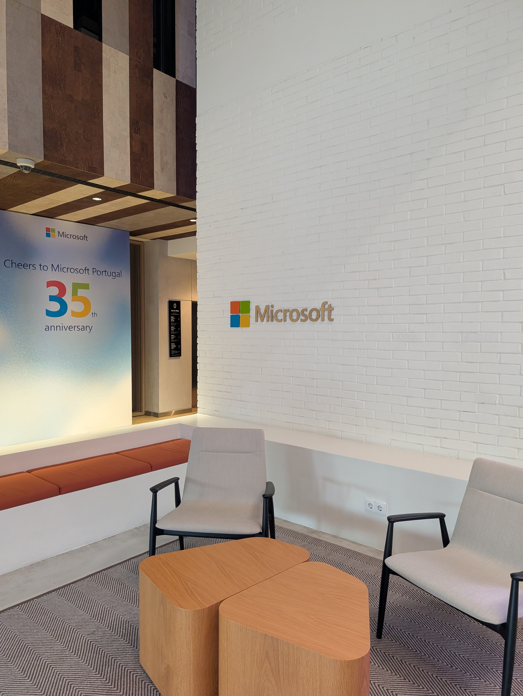
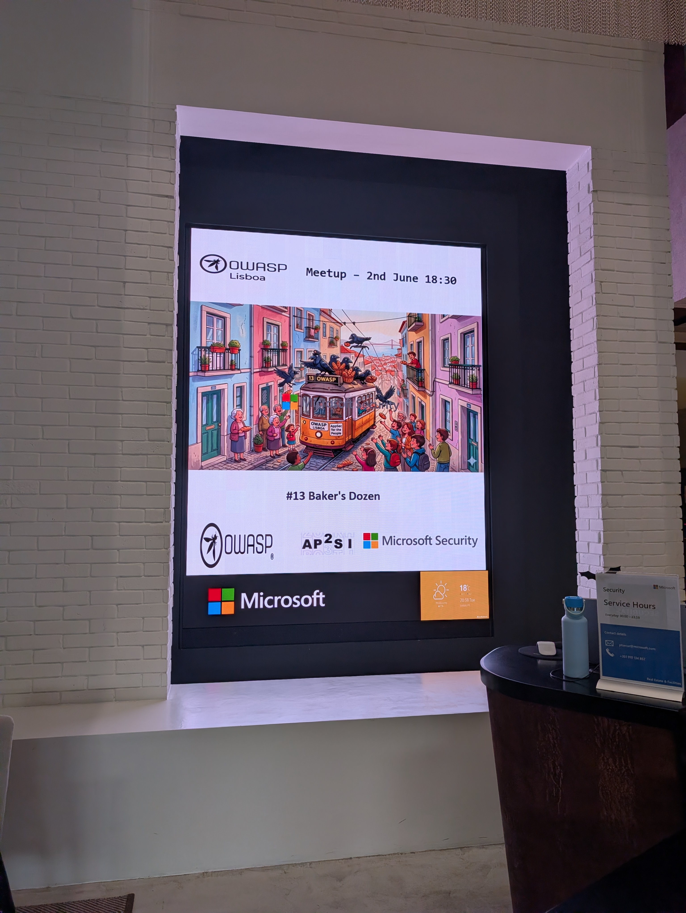
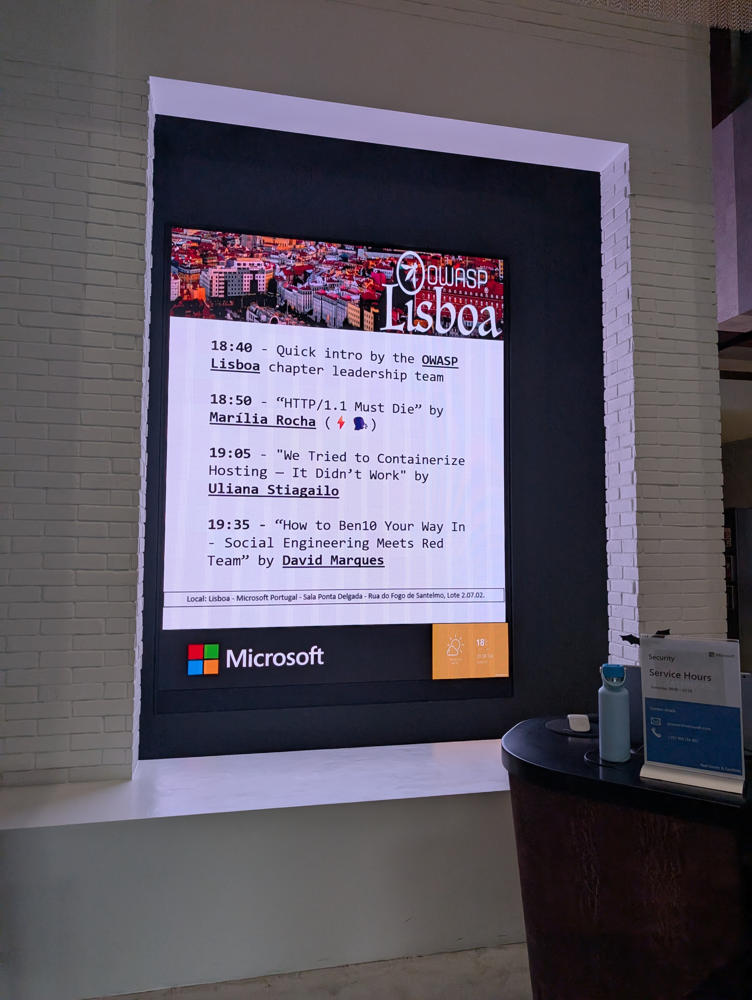
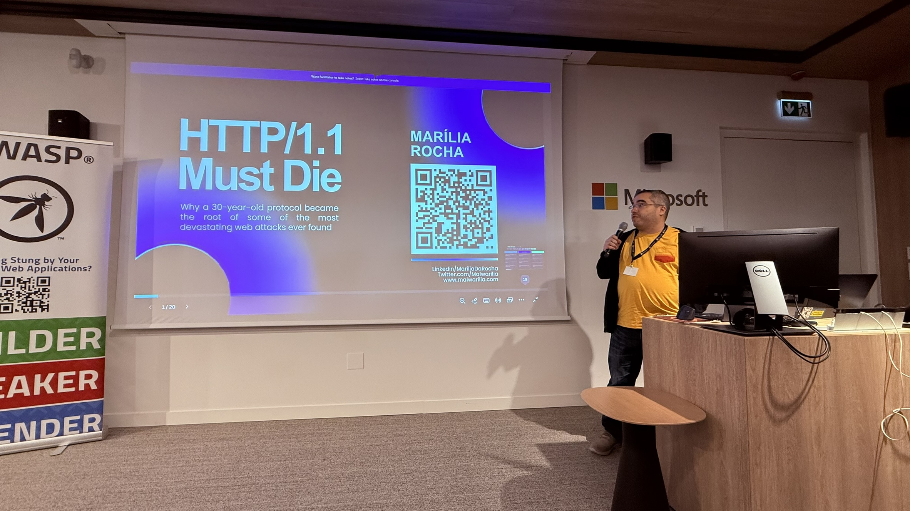
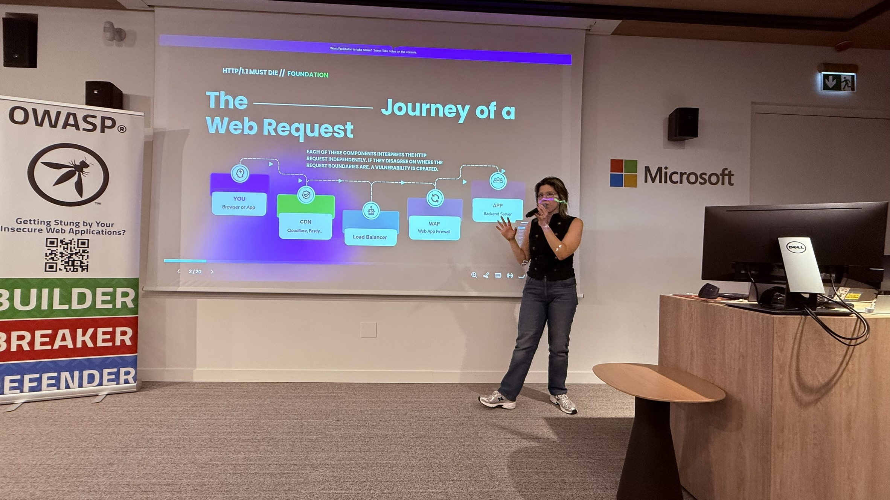
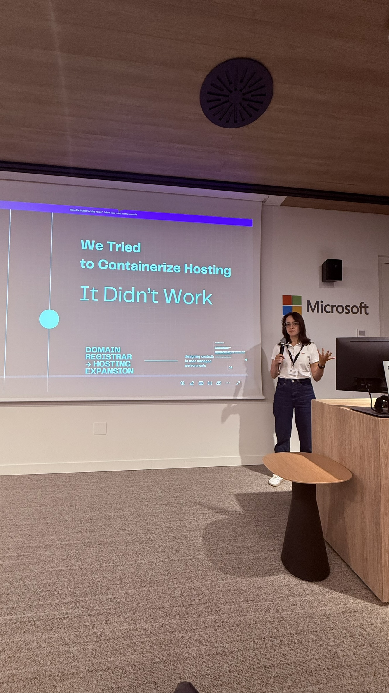
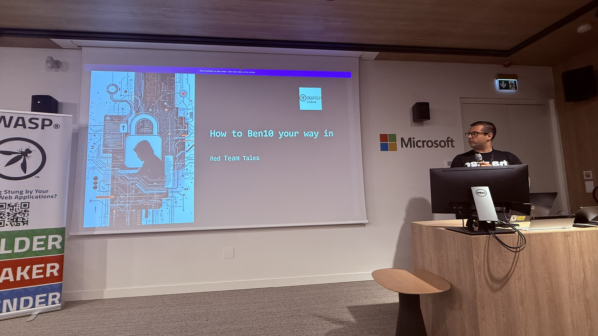
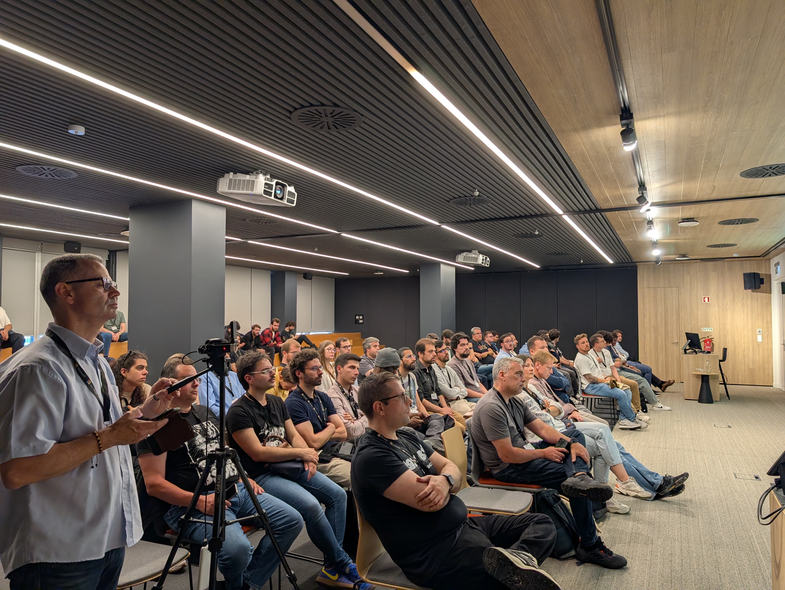
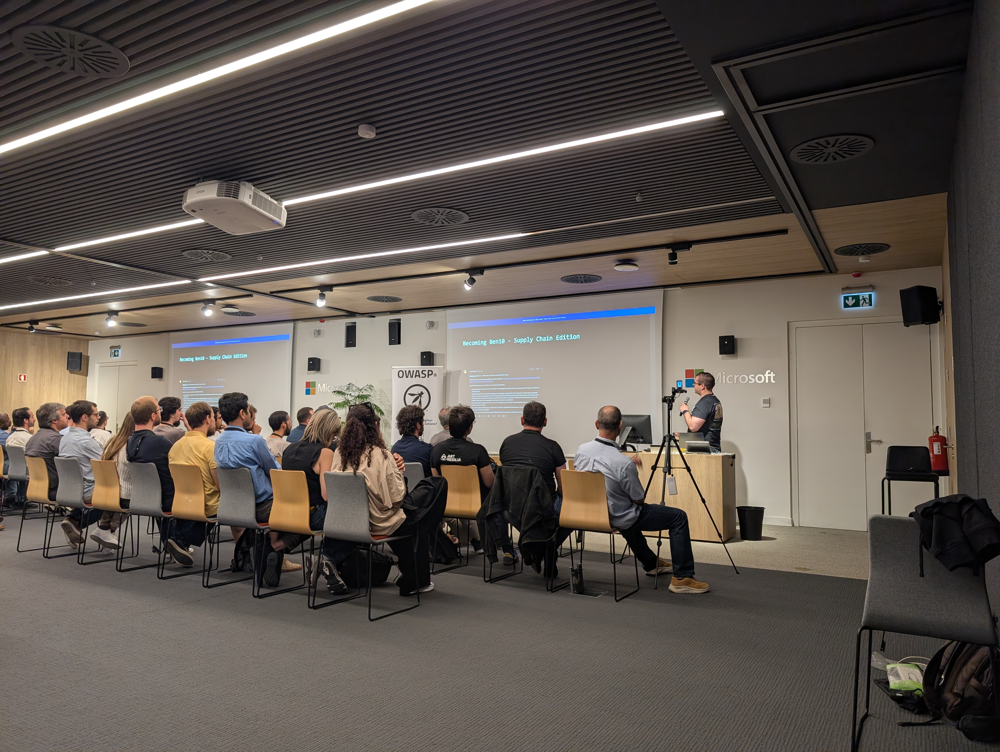
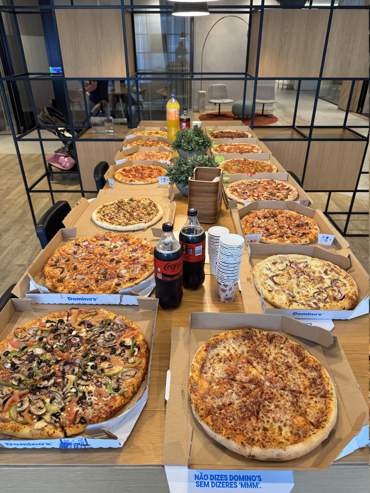

### Date:
June 2nd, 2026

### Videos:

Publication pending.

### Location:
[Microsoft Portugal](https://maps.app.goo.gl/nhpcJpKfcsj3VXgR9)

This meetup was sponsored by [Microsoft](https://www.linkedin.com/company/microsoft/) and [AP2SI](https://ap2si.org/).

### Agenda:
* 18:40: **Quick intro** by the OWASP Lisboa chapter leadership team
* 18:50: **HTTP/1.1 Must Die** by Marília Rocha
* 19:05: **We Tried to Containerize Hosting — It Didn’t Work** by Uliana Stiagailo
* 19:35: **How to Ben10 Your Way In - Social Engineering Meets Red Team** by David Marques

* * *

### HTTP/1.1 Must Die

HTTP Request Smuggling (HRS) remains one of the most dangerous and underestimated classes of web vulnerabilities, affecting major cloud providers, CDNs, APIs, and large-scale applications worldwide. Even though the industry has been progressively adopting newer standards, a significant portion of critical infrastructure still relies on HTTP/1.1 parsing behavior, and that legacy design is exactly what makes modern systems exploitable.

In this talk, HTTP/1.1 Must Die, we explore how inconsistencies between front-end and back-end servers (such as proxies, load balancers, CDNs, and application servers) allow attackers to craft desynchronized requests that bypass authentication controls, poison caches, leak sensitive data, or even gain full access to internal endpoints.

The session will cover:
• How HTTP/1.1 parsing ambiguities enable request smuggling
• Real-world attack scenarios using CL.TE and TE.CL techniques
• Why modern infrastructures remain vulnerable even behind WAFs
• The impact of HRS in microservices, serverless APIs, and reverse proxies
• How HTTP/2 and HTTP/3 mitigate many of these legacy issues
• Practical guidance for detection, testing, and mitigation
• Why organizations should accelerate their migration away from HTTP/1.1

The session includes hands-on examples, exploit demonstrations, and references to well-known research from PortSwigger, Cure53, and industry reports that shaped today’s understanding of HRS.

This talk aims to help security engineers, developers, and architects understand why maintaining HTTP/1.1 in production environments creates long-term systemic risk and why, for modern security, HTTP/1.1 really must die.

#### Marília Rocha

Marília Rocha is an Application Security Specialist with experience securing large-scale systems at Mercado Livre and BNP Paribas. Her work focuses on vulnerability management, secure development practices, and modern web security threats. She is also active in the security community, sharing research and training developers to build more secure applications.

[LinkedIn](https://www.linkedin.com/in/mar%C3%ADliadarocha/)

* * *

### We Tried to Containerize Hosting — It Didn’t Work

We were launching a hosting platform and initially planned to build it around containerization to ensure proper user isolation. However, the control panel we chose could not be containerized in practice, which forced us to fall back to a single-node architecture.

In this talk, I’ll walk through how we designed the system under these constraints: using system users, shared runtime components (Nginx, PHP-FPM, MySQL), and a control plane built around CloudPanel. While this approach worked operationally, it introduced subtle trade-offs in isolation, resource sharing, and system behavior that were not obvious at the start.

This is a practical, real-world story about building hosting as a service under imperfect conditions - and what actually happens when architectural assumptions (like containerization) don’t hold.

#### Uliana Stiagailo

I’m a CTO at Trustname, a domain registrar and hosting provider, where I lead platform architecture and infrastructure development across domains, DNS, hosting, SSL, and email services.

I’ve been working in software engineering since 2018 (8+ years), with a background in full-stack and frontend development. Over the past 2+ years as a CTO, I’ve been involved in building and scaling a range of infrastructure services, including domain registration, DNS, hosting, SSL, and email — working closely with external providers and real-world system constraints.

This talk is based on my hands-on experience of launching hosting as one of our services and dealing with architectural limitations in production.

[LinkedIn](https://www.linkedin.com/in/uliana-stiagailo/)

* * *

### How to Ben10 Your Way In - Social Engineering Meets Red Team

Every Red Team engagement shares a common objective: to emulate realistic attack scenarios performed by real-world adversaries, with the goal of demonstrating critical business impact rather than simply identifying vulnerabilities, as is typical in traditional penetration testing.

However, technological vulnerabilities are not always the primary path to compromise. In many cases, attackers achieve initial access by targeting the weakest link in corporate environments — people.

This presentation will showcase real-world attack scenarios that resulted in full organizational compromise, with the help of some social engineering techniques.

#### David Marques

Been working on pentesting for about 10 years and, for the last 5, specialized on Red Team engagements with some emphasis on Social Engineering. From stealing computer equipment to pose as a doctor, I’ve successfully conducted engagements on various companies and entities.

[LinkedIn](https://www.linkedin.com/in/david-marques-ba4689138/)

* * *

### Pictures from the meetup

* * *

* * *

* * *

* * *

* * *

* * *

* * *

* * *

* * *

* * *