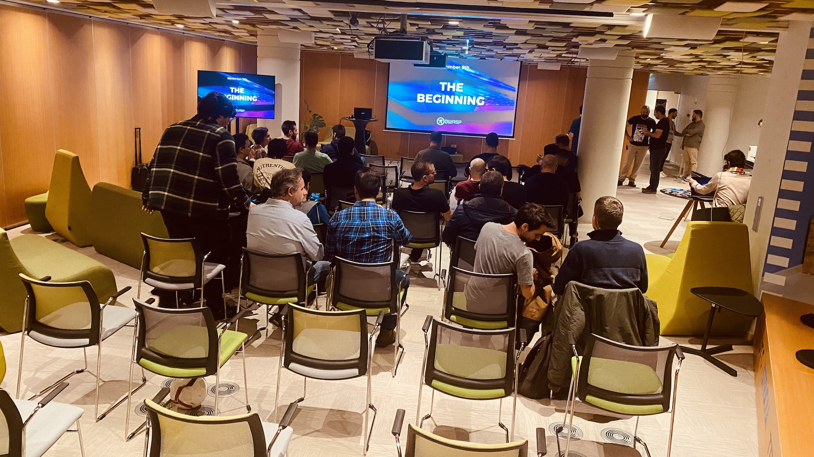

## February 28th, 2023:
\#2 Building Up

### Location:
[INESC-ID, Rua Alves Redol 9, Lisboa](https://goo.gl/maps/aP8v2mUnzwneRH5v7)

This meetup was supported by [INESC-ID](https://www.inesc-id.pt/) and [AP2SI](https://ap2si.org/).

* 18h00: **Welcome notes** by the OWASP Lisboa chapter leadership team
* 18h15: **[Surface Security: The experience so far and the road ahead](#surface-security-the-experience-so-far-and-the-road-ahead)** by Gustavo Silva
* 19h00: **[Is it private, is it public? Dependency Confusion](#is-it-private-is-it-public-dependency-confusion)** by Francisco Santos

### Surface Security: The experience so far and the road ahead
"At Paddy Power Betfair (Blip.pt), throughout the years we have developed a tool to help us have an inventory of all internal assets, from servers, to DNS records, to endpoint devices, but to also integrate other tools in it, like open source scanners to help us detect vulnerabilities, understand our exposure, weaknesses and priorities, as well as leverage built-in notifications, a slack bot, and much more.

This talk is to talk about this project, which was open sourced recently, and what is the roadmap for the future. "

#### Gustavo Silva
Software Developer by day, Security Researcher at night, I’m passionate for software security. The niche I am currently working on is engineering processes, tools, and internal interfaces to help companies secure their development lifecycles, do vulnerability management and increase overall awareness over the product's security risks.

[LinkedIn](https://www.linkedin.com/in/gsilvapt/)

### Is it private, is it public? Dependency Confusion
By 2021, the number of components in the average application rose 77 % from 298 to more than 500 open-source packages, those components are hosted on public repositories such as GitHub, NPM or PyPI, while some organizations choose to operate proprietary packages inside private registries of those repositories. Private or public, the management is done by CLI’s (like npm) and the CLI imports private or public packages via a simple precedence algorithm: If the package resides inside the private registry, import it. If not, import the public component. How can a bad actor play this to his advantage?

The is it private, is it public? Dependency Confusion talk explains what dependency confusion is, teaches ways of finding dependency confusion vulnerabilities in js files via BurpSuite with an automated tool called jsminer, a real example of a dependency confusion bug I found, and recommendations to mitigate those issues. By the end, breakers and makers should acquire a fresh new perspective on this issue.

#### Francisco Santos
"I'm Francisco Santos, 23 years old. I always liked to think out of the box and find weird solutions to problems. I like logic and solving puzzles. I enjoy being a breaker and I want to add value to that community.

[LinkedIn](https://www.linkedin.com/in/francisco-santos-77917a210/)
[Twitter](https://twitter.com/andr0idp4r4n0id)

### Pictures from the meetup

---

## November 9th, 2022:
The first meetup of the OWASP Lisboa Chapter - The Beginning.

### Location:
[OLX Portugal - Praça Duque de Saldanha nº 1 · Lisboa](https://goo.gl/maps/yeJVScaFdtoZcLoG7)

This meetup was supported by [OLX](https://olx.pt/).

### Agenda:
* 18h00: **The Beginning** by the OWASP Lisboa chapter leadership team
* 18h30: **[OWASP API Top10](#owasp-api-top10)** by Paulo Silva
* 19h00: **[Bots have gone phishing, but all they get is the boot](#bots-have-gone-phishing-but-all-they-get-is-the-boot)** by Pedro Fortuna and Jasvir Nagra
* 20h00: **Drinks & Dinner** by OLX

### Bots have gone phishing, but all they get is the boot
Web applications and the APIs which drive them are built with humans in mind. Exposing APIs enable interesting mashups of applications. But they also allow bots to automate access to these web applications, brute-forcing passwords, grabbing credit card numbers and gift cards; artificially inflating the price of goods and tickets; deny legitimate users service; and scraping content. Traditional approaches have focused on trying to detect legitimate browsers, known bot frameworks and user behavior but the easy availability of scriptable headless browsers are making this approach have diminishing returns. Bots are also commonly used in the context of phishing web apps. These apps are copies of the website, usually hosted in similar host names, where the user is tricked by means of phishing attacks. There, the user is convinced to enter their credentials, just like they would in the legitimate website. 2FA does not help in this context, as the user will likely volunteer this information, believing that the request comes from the legitimate website. Once in possession of the user credentials and 2FA, bots are used to automate the login into the account and steal sensitive data or commit fraud.

In this talk, we will give a brief overview of the broad goals bot-writers have when targeting your site, examples of how these have affected businesses, how traditional approaches to defending against them work and where they fail when faced with modern scripted browsers. We will then focus on phishing bots, and how to defend against them. We demonstrate a series of techniques using a combination of obfuscation and a one time token to increase the cost in time and money to a bot-writer rather than attempting to detect or block it. We will cover the challenges in creating such a solution, how to anticipate how bot-writers attempt to evade detection and how to proactively evolve the solution. A live demo will be included.

#### Pedro Fortuna
Once on a trajectory to a full academic career, where he taught security and computer science courses for about 5 years - ended up falling in love with the fast-paced world of entrepreneurship. He Started Jscrambler where he leads all security research and drives the company's product innovation on application security. Has more than 15 years of experience researching and working on web security. OWASP contributor. A regular speaker at several international security conferences. Main research interests lie in the fields of Application Security, Web Security, Reverse Engineering, Malware, and Software Engineering. Builder of solutions that require code rewriting, sandboxing, or both. Author of several patents in application security. Recently embraced fatherhood, his biggest and most important project to date.

#### Jasvir Nagra
Jasvir Nagra is widely recognized as a thought leader in software protection. He is co-author of Surreptitious Software, the definitive textbook on software protection, and an early researcher in obfuscation, software watermarking, and fingerprinting. With more than 12 years of experience, his professional path includes companies such as Instart, Dropbox and Google - where he led the Caja project. As an advisor to Jscrambler, he is helping cybersecurity startups address key technological challenges.

### OWASP API Top10
APIs are a foundational element of innovation in today's app-driven world, exposing business logic and access to sensitive data. Because of this APIs have increasingly become a target for attackers and, unsurprisingly, the common vector between major well-known data breaches.

We'll briefly discuss why we've decided to create yet another top 10 list, how it was built, and what our plans are for the next edition, but the master plan is to take most of the time to exploit a modern web application, deep diving into the top 10 API security risks as we spot them.

#### Paulo Silva
Since his first OWASP local event back in 2010, he has been an active community member contributing to several OWASP projects. Nowadays, he's the OWASP Go Secure Coding Practices project co-leader and OWASP API Security Project main collaborator.

With +15 years of professional experience developing software, at some point in time decided to focus on breaking it, helping several companies and organizations to improve their security posture, either as an ethical hacker, pentester, or security researcher.

### Pictures from the meetup

